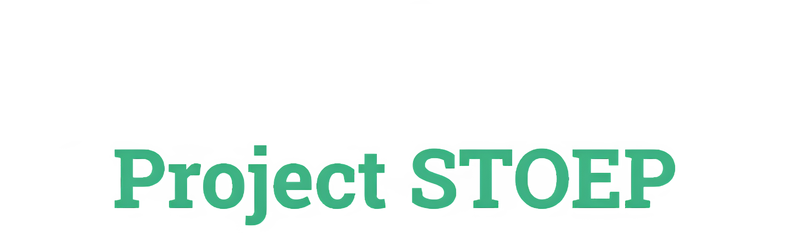
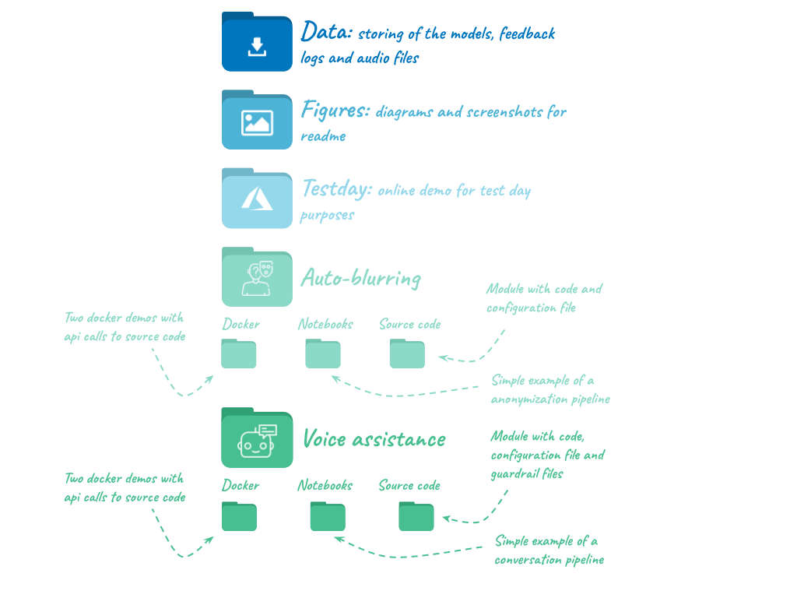
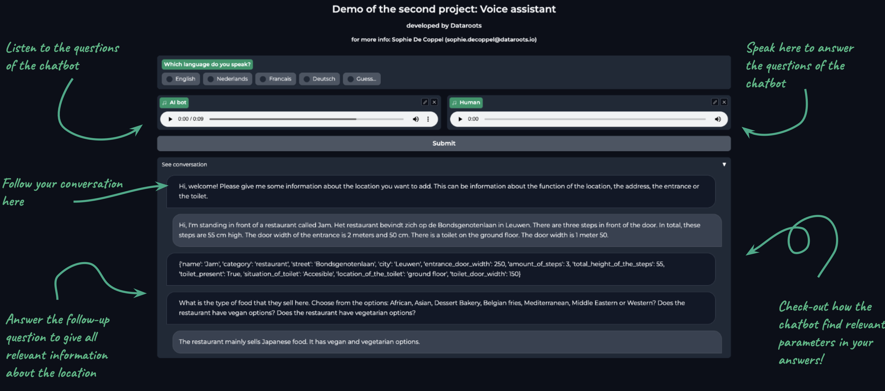

<p align="center">
  <a href="https://dataroots.io"></a>
  <a href="https://github.com/psf/black"></a>
  <a href="https://pycqa.github.io/isort/"></a>
  <a href="https://github.com/PyCQA/docformatter"></a>
  <a href="http://mypy-lang.org/"></a>
</p>

# Project STOEP: advancing the On Wheels app with AI
## Together we make accessibility truly accessible to everyone!

Together with [On Wheels app](https://www.onwheelsapp.com/en/) and [Amai!](https://amai.vlaanderen), we started project STOEP, which is a Flemish abbreviation of "Slimme TOegankelijkheid & Empowerment voor Personen met een beperking", or roughly translated: "Smart Accessibility and Empowerment for Persons with a Disability". It aims to enhance the On Wheels app with Artificial Intelligence.

[On Wheels app](https://www.onwheelsapp.com/en/) is an organisation that is actively working towards better accessibility of cities, buildings and mobility. Their app daily helps persons with a disability to easily get an overview of all accessible spaces in a google-maps-like fashion. [Amai!](https://amai.vlaanderen) is a project of the Flemish government to inspire, advise and empower citizens with Artificial Intelligence in their day to day life. It focuses on utilizing AI in work, climate, mobility and healthcare sectors.

Together with Dataroots (and [Amai!](https://amai.vlaanderen)), Onwheels wants to explore the possibilities to improve the app with the help of AI:
- First off, some users of the app may have additional disabilities (like visual impairment or limited fine motor skills in the hands) that restrict them from adding a location to the app. 
- Secondly, they want to accelerate the process of adding location to the app by automating the verification process of new data/images.

The scope of the project is explorative and aims to develop a small demo that can be worked out more in the industrialisation phase.


## Content

This repository provides the code that was used during the project at OnWheels. It includes two use cases:
- **Auto-blurring**: Using computer vision to anonimize sensitive information in the images that are uploaded to the app. The model focuses on the blurring of persons and cars.
- **Voice assistant**: Using NLP to create a voice assistant that allows users to add location to the app in a conversation format.

The follwing image depicts the different folders in this project:


Each project has its own folder. This folder contains the source code, 2 docker demos (for frontend and backend), some example notebooks and the required poetry environment.

The demo that was used during the test days can be found in the `testday` submodule. This container app was set up in the cloud with the help of two model endpoints (one for each project).

## How to start
You can either try out the google colab notebooks, run the code in a local environment or run the docker containers.

*Note: For the Voice Assistance project, you'll need an `OPENAI_API_KEY`. Configure this in a `.env` file before running the containers.*

### Model downloads
If you encounter any issues with the download of the models, you can run the command:  
```console
foo@bar:autoblurring$ poetry install
foo@bar:autoblurring$ poetry run python src/download_models.py
```

### Local environment
Both project folders contain a poetry environment that contains all necessary packages. Run the following commands to install the environment and run a project:
```console
foo@bar:autoblurring$ poetry install
foo@bar:autoblurring$ poetry run python docker/frontend/gradio_app.py
```
You can connect by visiting `localhost:7860`. 

Be sure to enable your microphone and sound for the voice assistant. Below, you can find an screenshot of an example conversation with the voice assistant.



### Colab notebooks
To try out the colab notebooks, visit the following links:
- **Auto-blurring**:   
  <a href="https://colab.research.google.com/drive/1fdbc26wKRtQRMqPe6M149LDNL6-1G0ck?usp=sharing" target="_parent"></a>
- **Voice assistant**:  
  <a href="https://colab.research.google.com/drive/141lOrftQ8a0_QnO83Xa-hZb_7YRmg1Fa#scrollTo=Zi3W6ZXa4T2N" target="_parent"></a>
        
### Deployement
You can launch the frontend and backend docker for a specific folder by going the the directory of the project and executing the following command:
```console
foo@bar:autoblurring$ docker-compose up
```
Finally, go to http://localhost:7860/ for the frontend demo and http://localhost:8080/docs#/default for the FastAPI demo.
