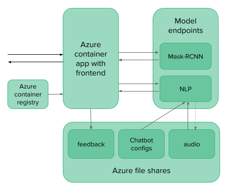

# How to create a testdemo on the Cloud

During the On Wheels project, we developed a online testdemo that could be used during test days.
The testdemo runs on the Cloud with the help of a containered app with the front end and two model endpoints that serve as the back end. This README will shortly explain how to set this up. A visualisation of the building blocs is shown below:

## 1. Registering your models
Before you can start to inference your models in a model endpoint, you need to register them. You can do this dynamicly with a retraining pipeline or you can simple upload the files in the Azure ML workspace. If you are planning to group certain model inferences inside the same model endpoint, be sure to register them in a group.

We created two groups, one for the computer vision models and one for the NLP models.
For the `mrcnn_endpoint` we registered the model **mask-rcnn** with the following files:
- The weights [frozen_inference_graph.pb](https://github.com/sambhav37/Mask-R-CNN/raw/master/mask-rcnn-coco/frozen_inference_graph.pb)
- and the configuration parameters [mask_rcnn_inception_v2_coco_2018_01_28.pbtxt](https://raw.githubusercontent.com/sambhav37/Mask-R-CNN/master/mask-rcnn-coco/mask_rcnn_inception_v2_coco_2018_01_28.pbtxt)

For the `voice_assistant_endpoint` we registerd the models **NLPmodels** with the following files:
- The [whisper medium](https://huggingface.co/openai/whisper-medium) model for transcription
- The coqui TTS files for [Dutch](https://coqui.gateway.scarf.sh/v0.8.0_models/tts_models--nl--css10--vits.zip), [French](https://coqui.gateway.scarf.sh/v0.8.0_models/tts_models--fr--css10--vits.zip), [German](https://coqui.gateway.scarf.sh/v0.7.0_models/tts_models--de--thorsten--vits.zip) and [English](https://coqui.gateway.scarf.sh/v0.6.1_models/tts_models--en--ljspeech--vits.zip).

You can download these models all manually or use the download scripts in the [parent repository of onwheels](https://github.com/datarootsio/onwheels).

## 2. Create the model endpoints
Secondly, we can create model endpoints from the model files. These model enpoints will serve as the back end of our app and will do all heavy computations. 

They require two key components:
- a **scoring file**: This is a python script that contains an initialization funtion and a run function. The initialization function will load the models and set all needed configurations. The run function will process the payload by inferencing the models and return the results. (Additionally you can add dependencies, which are helper files to your scoring script)
- the **model environment**: Your code will run  inside a docker container to manage the environment. Depending on the package you need, you can use a default environment or set-up your own. The MaskRCNN endpoint uses the existing `mcr.microsoft.com/azureml/minimal-ubuntu20.04-py38-cpu-inference:latest` docker image with an additional requirements file. The NLP endpoint uses a custom docker image and environment.

For each model endpoint you can then decide the virtual machine it runs on. Depending on the computing power you need (GPU or CPU and the amount of cores), it will be more costly. Here, you can also decide the instance count to allow for heavy use.

For the On Wheels testdemo, we created two model endpoint, one for each project. How many model endpoints you decide to use entirely depends on your budget. The necessary files for our model endpoints can be found in the `mrcnn_endpoint` and `voice_assistant_endpoint` directories. 

## 3. Create a docker image and link it to Azure Container Registry
To create a container app, we first need a container. We will store this container in a Azure Container Registry (ACR) so we can easily update the app. 

Create an container registry and store the login server. Now create a docker image for the front end of your application and push it to the container registry. 

*Note: If you are creating your docker image, be sure to build it for the linux amd64 architecture (the Azure default).You can do this with:  
`docker buildx build --platform linux/amd64`

## 4. Create a container app
Now, we can finaly create the container app. When setting up your app, link it to the ACR, be sure to enable ingress and set the scaling and resources to your needs.

The conainer app will take some time to load the image and will then open it to the public via a link. If your deployment fails you can debug it through log stream or console. The url may look ugly at first but it can be customized to your desire with the help of custom domains.

## 5. Add the environment secrets
To link your front end to your back end model endpoints, it's best practice to store the api keys in the secrets of the container app. You can then add them as environment variables to your container.
For our project, we also stored the Open API key here.

## (Optional) 6. Link the necessary file shares
Optionally, you can also link file shares to your container app to access certain files and write logs. We used this feature to store the configuration files of the voice assistant, save the audio input and output files, log the feedback of the users and cache some examples.

This file shares can be added in the managed environment of the container app. There you can configure them by supplying the storage account name and key and the necessary access rights. You can then add them to your container as volumen mounts. Be sure to provide a valid mount path (f.e. /app/feedback/).
